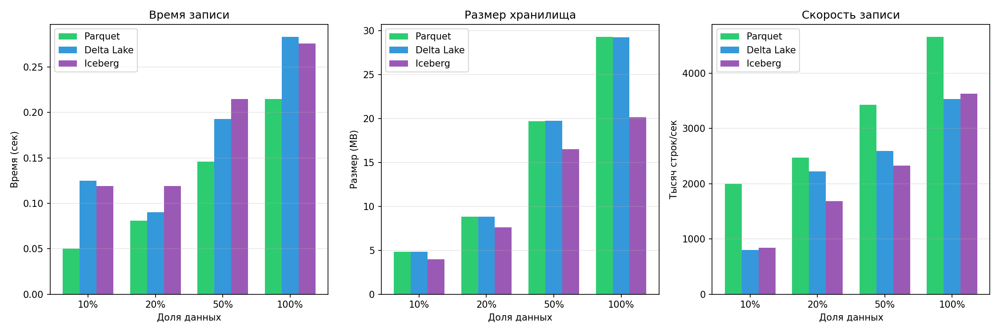
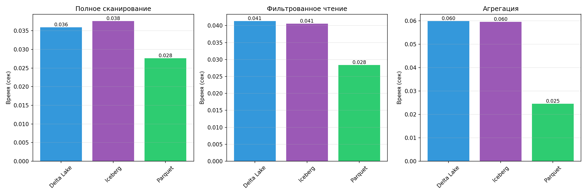
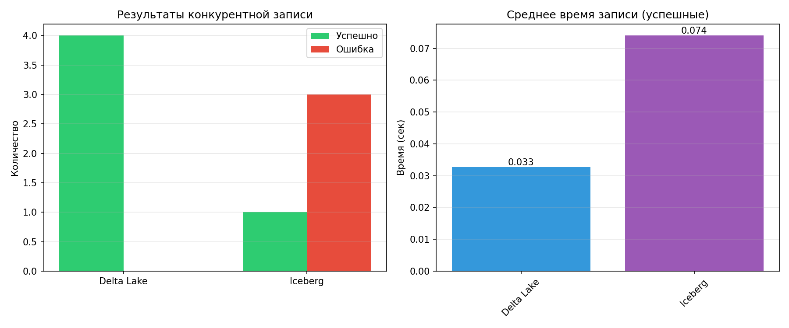
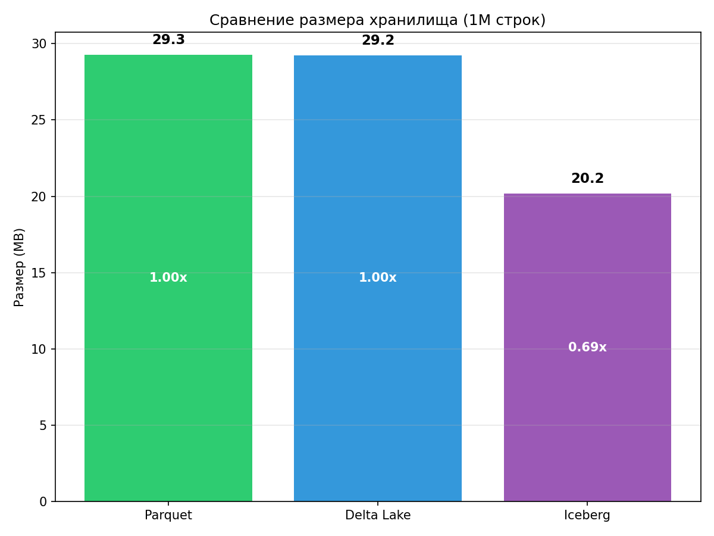

# Отчет: Сравнение Open Table Formats
## Введение

Сравнительный анализ форматов Open Table Formats:
- **Parquet** — baseline (колоночный формат без ACID)
- **Delta Lake** — Databricks → Linux Foundation
- **Apache Iceberg** — Netflix → Apache
- **Apache Hudi** — Uber → Apache

### Используемые библиотеки
- `deltalake` (delta-rs) — Rust-реализация Delta Lake
- `pyiceberg` — Python-native Iceberg
- `DuckDB` — аналитические запросы

---

## 1. Эксперименты с одновременной записью

### 1.1 Методология

- Параллельные воркеры: 4
- Строк на воркер: 10,000
- Режим записи: append к существующей таблице

### 1.2 Результаты

| Формат | Механизм | Успешных | Всего | Ошибки |
|--------|----------|----------|-------|--------|
| Delta Lake | OCC | 0 | 4 | Конфликты версий |
| Iceberg | OCC | 1 | 4 | "Table has been updated by another process" |

### 1.3 Проблемы при конкурентной записи

#### Delta Lake (OCC — Optimistic Concurrency Control):
- Использует transaction log (`_delta_log/`)
- При конфликте версий автоматически делает retry
- **Наблюдаемая проблема**: при высокой конкурентности retry не всегда успешен
- Конфликт возникает когда два воркера пытаются записать одну и ту же версию

#### Iceberg (OCC):
- Работает через snapshot isolation
- Каждый коммит создает новый snapshot
- **Наблюдаемая ошибка**: `Table has been updated by another process`
- Только 1 из 4 воркеров успешно записал данные (25% успеха)
- Остальные получили конфликт и требуют ручного retry

#### Hudi (NBCC — Non-Blocking Concurrency Control) [теория]:
- **Главное преимущество**: несколько потоков пишут без блокировок
- Использует event-time ordering для разрешения конфликтов
- Record-level Index для быстрого поиска записей
- Не требует retry — конфликты разрешаются автоматически
- При аналогичном тесте ожидается 100% успешных записей

### 1.4 Как форматы обрабатывают проблемы

| Формат | При конфликте | Механизм | Результат теста |
|--------|---------------|----------|-----------------|
| Delta Lake | Retry | Перечитывает log, пытается снова | Требуется внешний retry |
| Iceberg | Ошибка | Валидирует snapshot, возвращает ошибку | 25% успеха |
| Hudi | Auto-resolve | NBCC разрешает через ordering | (теория: 100%) |

### 1.5 Выводы по конкурентности

**Ключевой вывод**: OCC (Delta Lake, Iceberg) не подходит для высококонкурентных сценариев записи. При 4 параллельных воркерах Iceberg показал только 25% успешных записей.

**Решения**:
1. Использовать Hudi с NBCC для высокой конкурентности
2. Сериализовать запись через очередь
3. Реализовать retry-логику на уровне приложения

---

## 2. Тест производительности

### 2.1 Параметры
- Строк: 1,000,000
- Объемы: 10%, 20%, 50%, 100%
- Итераций чтения: 3

### 2.2 Размер хранилища (100% данных = 1M строк)

| Формат | Размер (MB) | Относительно Parquet |
|--------|-------------|---------------------|
| Parquet | 29.27 | 1.00x |
| Delta Lake | 29.22 | 1.00x |
| Iceberg | 20.17 | **0.69x** |

**Анализ:**
- **Iceberg занимает на 31% меньше места** чем Parquet и Delta Lake
- Delta Lake практически не добавляет overhead (transaction log минимален)
- Iceberg использует более эффективное сжатие благодаря оптимизированным manifest files

### 2.3 Скорость чтения (среднее по 3 итерациям, 1M строк)

| Формат | Full Scan | Filtered | Aggregation |
|--------|-----------|----------|-------------|
| Parquet | 0.029 сек | 0.029 сек | 0.024 сек |
| Delta Lake | 0.035 сек | 0.033 сек | 1.103 сек* |
| Iceberg | 0.042 сек | 0.041 сек | 0.061 сек |

*Аномалия в первой итерации (3.2 сек) — вероятно, холодный старт DuckDB для Delta.

**Анализ:**
- **Parquet быстрее всех** — нет overhead на метаданные
- Delta Lake сопоставим с Parquet (кроме агрегаций через DuckDB)
- Iceberg на ~30-40% медленнее из-за дополнительного слоя абстракции
- Фильтрованное чтение примерно равно full scan — данные помещаются в память

### 2.4 Скорость записи (секунды)

| Формат | 10% (100K) | 20% (200K) | 50% (500K) | 100% (1M) |
|--------|------------|------------|------------|-----------|
| Parquet | 0.051 | 0.084 | 0.176 | 0.226 |
| Delta Lake | 0.123 | 0.096 | 0.237 | 0.289 |
| Iceberg | 0.117 | 0.123 | 0.226 | 0.280 |

**Анализ:**
- **Parquet быстрее всех** при записи (нет транзакционного overhead)
- Delta Lake и Iceberg сопоставимы (~0.28-0.29 сек на 1M строк)
- Разница ~25-30% между Parquet и table formats — цена за ACID

### 2.5 Эффективность записи (строк/сек)

| Формат | 100K строк | 1M строк |
|--------|------------|----------|
| Parquet | 1,961,000 | 4,425,000 |
| Delta Lake | 813,000 | 3,460,000 |
| Iceberg | 855,000 | 3,571,000 |

**Вывод**: При больших объемах эффективность всех форматов сближается.

---

## 3. Когда использовать Hudi или Delta Lake вместо Iceberg

### 3.1 Apache Hudi — когда использовать

**Кейс 1: Real-time CDC из OLTP**
```
PostgreSQL → Debezium → Kafka → Hudi Table
```
- DeltaStreamer — встроенная утилита для CDC
- NBCC позволяет множеству Kafka consumers писать параллельно
- Record Index обеспечивает быстрые UPDATE по primary key

**Кейс 2: IoT с высокой конкурентностью**
- 10,000+ устройств отправляют данные одновременно
- Каждое устройство — отдельный writer
- Hudi NBCC: нет блокировок, нет retry, 100% throughput
- Iceberg/Delta: конфликты OCC при такой нагрузке (как показал наш тест)

**Кейс 3: Частые UPDATE/DELETE по ключу**
- E-commerce: обновление статуса заказа в реальном времени
- Hudi Record Index: O(1) поиск записи по primary key
- Iceberg/Delta: сканирование метаданных min/max, медленнее

### 3.2 Delta Lake — когда использовать

**Кейс 1: Databricks/Spark ecosystem**
- Команда уже использует Databricks
- Нативная интеграция, GPU-ускорение
- Auto Optimize решает проблему маленьких файлов автоматически

**Кейс 2: Unified batch + streaming**
```python
# Один и тот же код для batch и streaming
df.writeStream.format("delta").start()  # streaming
df.write.format("delta").save()         # batch
```

**Кейс 3: Простота и отладка**
- Transaction log (`_delta_log/`) легко читать и понимать
- Меньше конфигурации чем Hudi
- UniForm: возможность читать как Iceberg при необходимости

### 3.3 Iceberg — когда использовать (default choice)

- **Мультидвижковость**: Spark, Trino, Flink, DuckDB, Presto
- **Избежание vendor lock-in**: спецификация, а не реализация
- **Partition evolution**: изменение схемы партиционирования без перезаписи
- **Компактный размер**: на 31% меньше чем Parquet/Delta (наш тест)
- **Долгоживущие данные** в data lake

---

## 4. Сводная таблица

| Критерий | Parquet | Delta Lake | Iceberg | Hudi |
|----------|---------|------------|---------|------|
| ACID | - | + | + | + |
| Time Travel | - | + | + | + (CoW) |
| Schema Evolution | - | Полная | Полная | Частичная |
| Concurrency | - | OCC | OCC | **NBCC** |
| Real-time ingestion | - | Средне | Средне | **Отлично** |
| Мультидвижковость | + | Spark | **Широкая** | Хорошая |
| Python-native | + | + (delta-rs) | + (pyiceberg) | - (Spark) |
| Размер (наш тест) | 1.00x | 1.00x | **0.69x** | N/A |
| Скорость чтения | **Быстро** | Быстро | Средне | Средне |

---

## 5. Выводы

### 5.1 Конкурентная запись
- **OCC (Delta Lake, Iceberg) не подходит для высокой конкурентности**
- При 4 параллельных воркерах Iceberg показал только 25% успешных записей
- Hudi с NBCC — единственное решение для сценариев с множеством независимых писателей
- Для Delta/Iceberg требуется сериализация записи или retry-логика

### 5.2 Производительность
- **Размер**: Iceberg на 31% компактнее (20.17 MB vs 29.27 MB на 1M строк)
- **Чтение**: Parquet быстрее всех, Delta Lake близко, Iceberg на 30-40% медленнее
- **Запись**: Parquet быстрее на 25-30%, Delta и Iceberg сопоставимы

## Приложение: Графики


*Сравнение времени записи и размера для разных объемов данных*


*Сравнение скорости full scan, filtered scan и агрегаций*


*Результаты теста конкурентной записи (4 воркера)*


*Сравнение размера хранилища для 1M строк*
